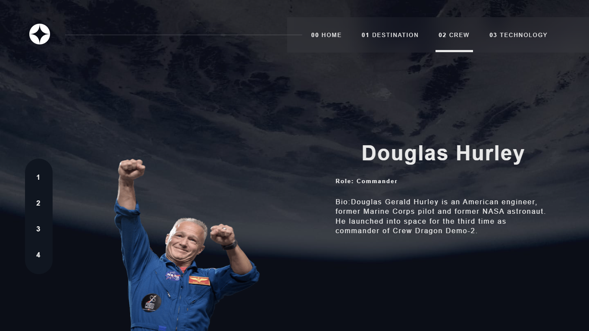

# Frontend Mentor - Loopstudios landing page solution

This is a solution to the [Loopstudios landing page challenge on Frontend Mentor](https://www.frontendmentor.io/challenges/loopstudios-landing-page-N88J5Onjw). Frontend Mentor challenges help you improve your coding skills by building realistic projects.

## Table of contents
- [Screenshot](#screenshot)
- [Built with](#built-with)
- [Author](#author)

### Screenshot

### Built with

- Sass
- Flexbox
- [React](https://reactjs.org/) - JS library

## Author

- Frontend Mentor - [@yAltamiroF-22](https://www.frontendmentor.io/profile/AltamiroF-22)
- Instagram - [@junior.rx22](https://www.instagram.com/junior.rx22/)

# Frontend Mentor - Space tourism website solution

This is a solution to the [Space tourism website challenge on Frontend Mentor](https://www.frontendmentor.io/challenges/space-tourism-multipage-website-gRWj1URZ3). Frontend Mentor challenges help you improve your coding skills by building realistic projects. 

